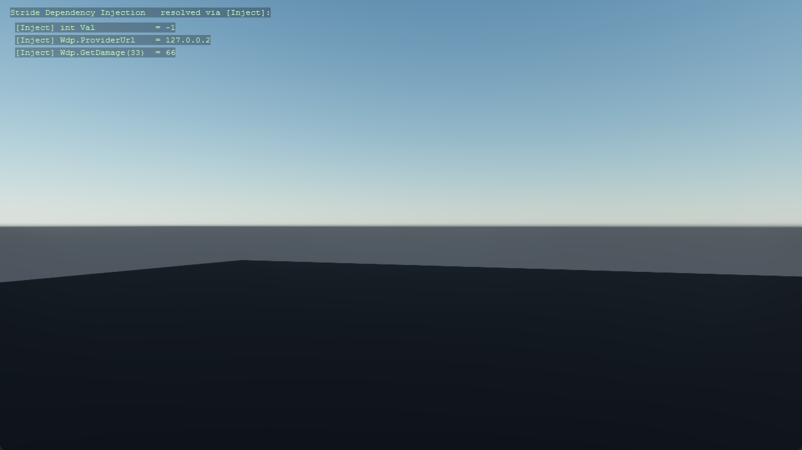

# Your Asset Name

<!-- One-line pitch: what it does + why it's cool. This is the first (often only) thing read. -->
A one-sentence pitch of your asset for [Stride](https://www.stride3d.net/).

<!-- A GIF/MP4 beats ten paragraphs. Motion sells: show the asset DOING its thing. -->


[](https://nicogo1705.github.io/AssetStore/a/com.yourname.your-asset)

## What's in the box

| File | Role |
|------|------|
| `ExampleScript` | Drop-in `SyncScript` — attach it in Game Studio (category *Template*), press play. |
| `StrideAssetTemplate.sdpkg` | The Stride package. Without it the asset can only ship C#, not content. |
| `Assets/` | Stride content: scenes, materials, prefabs, textures, models, sounds. |
| `Resources/` | The source files those assets are built from: `.png`, `.fbx`, `.wav`… |
| `Assets/ExampleTexture.sdtex` | One worked example of the pair: an asset in `Assets/` pointing at a file in `Resources/`. Listed under `RootAssets` in the `.sdpkg`, so it is always compiled and loadable by URL. |
| *(your files)* | *(what each public type is for, one line each)* |

Content is loaded by a URL that starts with the package name — `Content.Load<Texture>("/StrideAssetTemplate/ExampleTexture")`.
A bare `"ExampleTexture"` only resolves inside the package that owns it, and fails to load from a
project that merely references your asset.

## Quick start (drop-in)

1. Install from the [Community Stride Asset Store](https://nicogo1705.github.io/AssetStore/a/com.yourname.your-asset) (or clone + `<ProjectReference>`).
2. Add an empty entity, attach the **ExampleScript** component (category *Template*).
3. Press play.

## Use it from code (advanced)

```csharp
// Show the minimal code-first path: construction, one or two key calls, per-frame usage.
var example = new ExampleScript { Message = "Hi!" };
entity.Add(example);
```

## Performance

<!-- Keep this section for GPU/perf-sensitive assets; delete otherwise.
     Even approximate numbers defuse skepticism. -->
| Workload | GPU | FPS (demo scene) |
|---|---|---|
| _e.g. 250 000 instances_ | _e.g. RTX 3060_ | _e.g. 240_ |

## Demo

```bash
cd Demo
dotnet run
```

Or open `StrideAssetTemplate.sln` and start the **Demo** project. It runs on Windows, Linux and
macOS from that one project — Stride picks Direct3D11 or Vulkan from the machine it is built on.
Fly around with WASD + right-mouse.

The reviewers run this first, and the store can launch it for your users in one click — make it
show off the asset.

## License

MIT. See [LICENSE.md](LICENSE.md).
